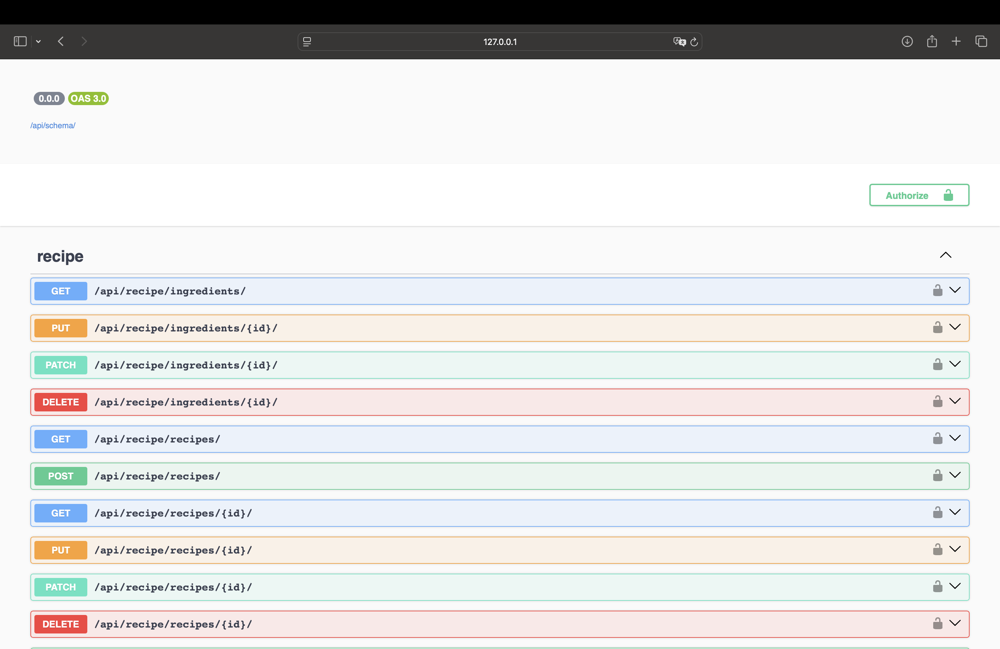
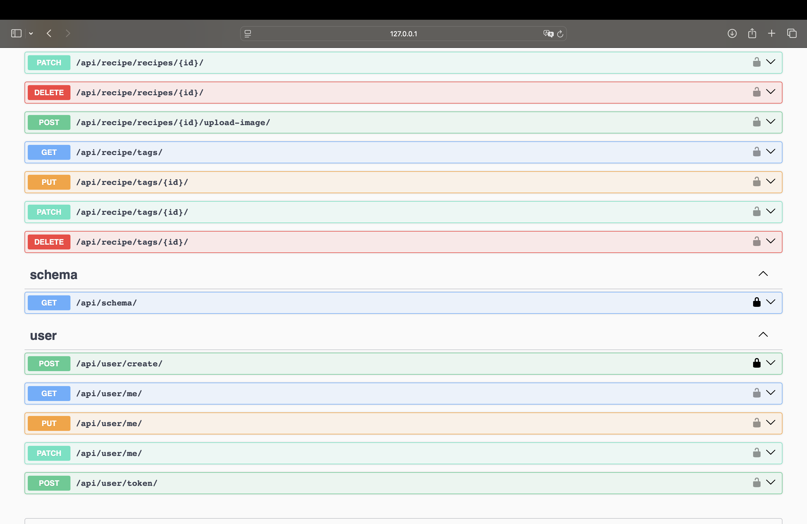

# Recipes

A recipes application REST API implemented in Django REST framework.

### Prerequisites

Download and install [Python](https://www.python.org/downloads/) runtime and [PostgreSQL](https://www.postgresql.org/download/) database.

## Database setup

Set up database admin user with the following credentials:
```
'HOST': 'localhost'
'DB_NAME': 'recipes'
'USER': 'postgres'
'PASSWORD': 'pass'
'PORT': '5432'
```

## Run project

1. Go to _recipes_ folder and install all dependencies from `requirements.txt` using `pip install`.
```console
recipes$ python -m venv .venv
recipes$ ./.venv/Scripts/activate
(.venv) recipes$ pip install -r ./requirements.txt
```
2. Go to _recipes_ folder and migrate data to database:
```console
(.venv) recipes$ python manage.py migrate
```
3. Run the application inside _recipes_ folder:
```console
(.venv) recipes$ python manage.py runserver
```

## Run tests

Go to _recipes_ folder and run command:
```console
(.venv) recipes$ python manage.py test
```

## Overview

Recipes REST API contains:
 - 21 CRUD operations
 - 4 models: Recipe, Ingredient, Tag, User
 - over 60 tests

## Presentation

| Swagger UI 1                     | Swagger UI 2                     | 
|----------------------------------|----------------------------------|
|  |  |
